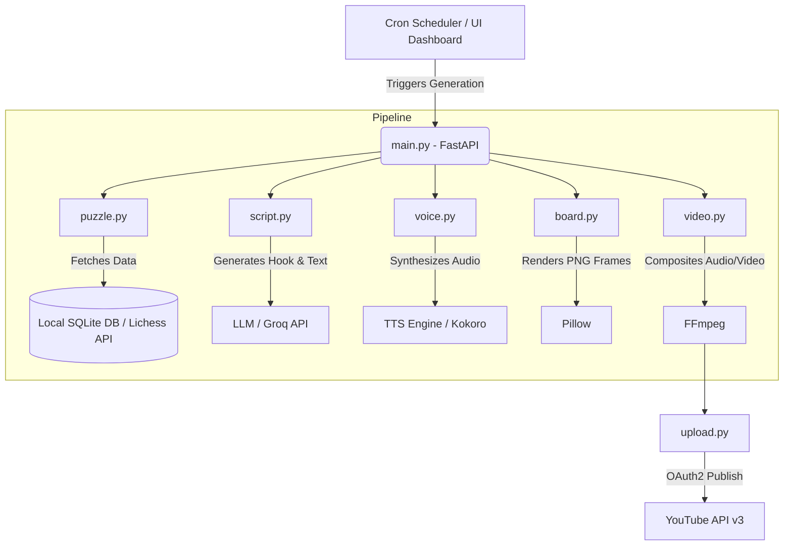

# ♟️ Chess Shorts Automation Pipeline

An end-to-end, fully autonomous AI pipeline that generates, renders, and publishes high-quality Chess Shorts to YouTube. Built with a decoupled, asynchronous, and robust architecture to ensure production-grade reliability.

## 🚀 Overview
This system is designed to completely automate the creation of chess content for YouTube Shorts. It takes a chess puzzle or a grandmaster game, writes an engaging AI voiceover script, renders a 30-second vertical video with synchronized piece animations, overlays text captions and background music, and finally authenticates with the YouTube Data API to publish the video—all without human intervention.

The system supports three distinct formats:
- **⚡ Flash Puzzles:** Fast-paced, 10-15 second tactical puzzles ("Can you find the winning move?").
- **📖 Champion Stories:** 30-second narrated sequences showcasing brilliant checkmates from Lichess grandmaster games.
- **📚 Puzzle Series:** A progressive series of puzzles designed for high-retention playlists.

## 🏗️ System Architecture



## 🧠 System Design Concepts

This project was built with scalability and reliability in mind, utilizing the following system design principles:

### 1. Microservices-Style Modular Pipeline (Separation of Concerns)
Instead of a monolithic script, the system is deeply decoupled into specialized modules (`board.py`, `script.py`, `voice.py`, `video.py`, `upload.py`). 
* **Benefit:** You can easily swap components (e.g., swapping the Kokoro TTS engine for ElevenLabs, or modifying the FFmpeg rendering logic) without affecting the rest of the pipeline.

### 2. Local Caching & Offline Fallbacks
When the Lichess API imposes rate limits (`429 Too Many Requests`), the system gracefully falls back to a **Local Offline Database**.
* **Benefit:** By caching 50,000+ puzzles into a local SQLite database on startup, we reduce network latency to `0ms`, eliminate API rate limits, and remove a massive single point of failure.

### 3. Asynchronous I/O (Non-Blocking Operations)
The backend is built on **FastAPI**, leveraging `async/await` and non-blocking HTTP clients (`httpx`).
* **Benefit:** While the server is busy compiling a heavy FFmpeg video or waiting for the YouTube API to respond, the main thread isn't blocked. The UI dashboard remains fully responsive.

### 4. Idempotency and State Management
We designed a lightweight SQLite database to track exactly what content has been generated (`used_content` table) and the precise state of every video (`pending` vs `uploaded`).
* **Benefit:** **Idempotency** guarantees that you will never generate a video on the same chess puzzle twice, even if the system crashes and restarts.

### 5. Fault Tolerance & Graceful Degradation
The pipeline implements defensive programming around vulnerable network calls (e.g., when the YouTube API throws a `403 Forbidden` error during a thumbnail upload).
* **Benefit:** Instead of crashing the entire pipeline and destroying a rendered video, the system catches the error, logs a warning, and gracefully continues to publish the video.

### 6. Event-Driven Scheduling
By integrating `APScheduler`, the system is capable of running as a background daemon.
* **Benefit:** It transitions the software from a manual "click-to-run" tool into a fully autonomous cron-job architecture that can generate and publish videos daily on a strict schedule.

## 🛠️ Tech Stack
- **Backend:** Python, FastAPI, APScheduler
- **Video Rendering:** Pillow (PIL) for frame generation, FFmpeg for compositing and audio mixing
- **Database:** SQLite
- **APIs:** Lichess API, YouTube Data API v3, Google OAuth2
- **AI/TTS:** Local/Cloud LLMs for script generation, Kokoro for TTS

## ⚙️ Setup & Installation

1. **Install Dependencies:**
   ```bash
   pip install -r requirements.txt
   ```
2. **Install FFmpeg:** Ensure `ffmpeg` is installed and added to your system's PATH.
3. **Environment Variables:** Create a `.env` file and configure your API keys (e.g., Groq API, TTS endpoints).
4. **YouTube Credentials:** Place your Google Cloud `credentials.json` in the root directory for OAuth2 authentication.
5. **Run the Server:**
   ```bash
   uvicorn main:app --reload
   ```

## 🎥 Pipeline Workflow
1. **Scraping:** Grabs a puzzle/game from Lichess (or local DB).
2. **Scripting:** Generates an engaging 30-second script via LLM.
3. **Voiceover:** Synthesizes the AI voiceover.
4. **Rendering:** `board.py` generates individual PNG frames of the chess moves.
5. **Compositing:** `video.py` orchestrates FFmpeg to weave the frames, sound effects, voiceover, background music, and animated captions together.
6. **Publishing:** Authenticates via OAuth2 and uploads to YouTube Shorts.
